# 🏡 Shire Map Builder

**Isometric map editor สำหรับสร้างแผนที่ fantasy แบบ Shire theme**

Shire Map Builder คือเว็บแอปสำหรับออกแบบแผนที่แบบ isometric ผ่านระบบ tile-based grid โดยเน้นประสบการณ์ใช้งานที่เรียบง่ายแต่พร้อมต่อยอดสำหรับงานจริง ผู้ใช้สามารถเลือก asset ธีม Shire จากหลายหมวดหมู่แล้วนำมาวางบนแผนที่ได้ทันที พร้อมความสามารถสำคัญอย่าง undo/redo, pan/zoom, import/export JSON และดาวน์โหลดแผนที่เป็น PNG เพื่อใช้ต่อในงานเกม งานเล่าเรื่อง งาน worldbuilding หรือใช้เป็นต้นแบบสำหรับพัฒนา map editor ในโปรเจกต์อื่น

โปรเจกต์นี้เหมาะทั้งในฐานะเครื่องมือสร้างแผนที่ขนาดเล็ก และในฐานะตัวอย่างสถาปัตยกรรม frontend ที่ผสาน React, PixiJS, Zustand และ TypeScript เข้าด้วยกันอย่างชัดเจน โดยแยก concerns ระหว่าง UI, state management, asset catalog และ isometric math ออกจากกัน ทำให้แก้ไข เพิ่ม theme ใหม่ หรือแตกต่อเป็นระบบที่ซับซ้อนขึ้นได้ง่าย

---

## 📖 แนวคิดและจุดประสงค์

Shire Map Builder เป็น **interactive isometric map editor** ที่ทำงานบน browser ออกแบบมาเพื่อให้ผู้ใช้สร้างแผนที่ isometric แบบ tile-based ในธีม Shire (ดินแดนฮอบบิท) ได้อย่างง่ายดาย

**ใช้ทำอะไรได้:**

- สร้าง/ออกแบบแผนที่ isometric สำหรับเกม, นิยาย, หรือ TTRPG
- ทดลอง/เรียนรู้ isometric coordinate system และ 2D rendering ด้วย PixiJS
- Export แผนที่เป็น PNG สำหรับใช้ใน presentation หรือ social media
- Import/Export JSON สำหรับเก็บ/แชร์ map data

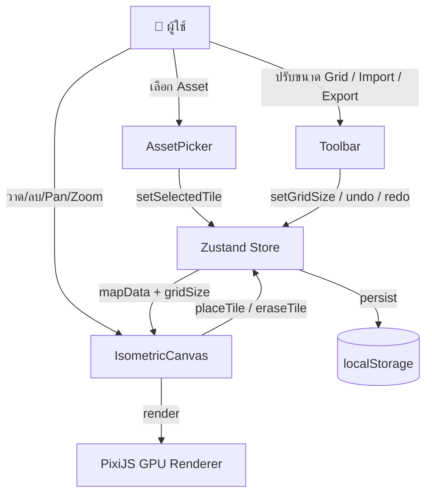

**หลักการทำงาน:**

1. **Grid System** — แผนที่คือ dictionary ของ coordinate key `"x,y"` แต่ละ cell มี 2 layer: `terrain` (ภูมิประเทศ) และ `character` (props/ของตกแต่ง)
2. **Isometric Projection** — แปลง grid (x,y) เป็นตำแหน่งจอด้วยสูตร 2:1 ratio (`screenX = (x-y) × tileWidth/2`, `screenY = (x+y) × tileHeight/2`)
3. **Depth Sorting** — เรียงลำดับการวาดด้วย `x + y` (ช่องที่อยู่ด้านหน้าวาดทีหลัง) โดย character layer จะได้ +0.5 เพื่อวาดทับ terrain เสมอ

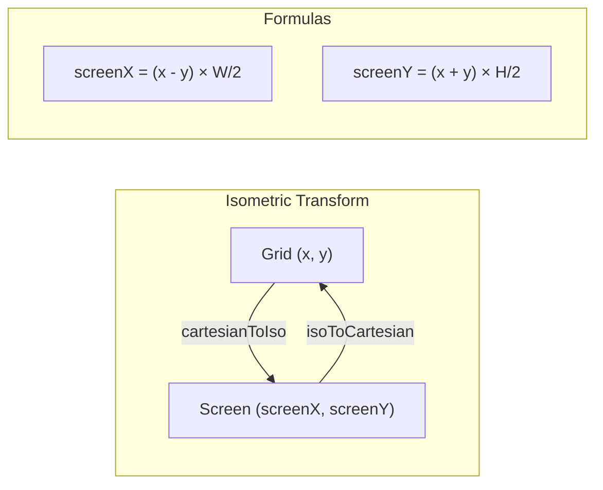

---

## 🛠 Tech Stack

| เทคโนโลยี        | เวอร์ชัน | หน้าที่                                     |
| ---------------- | -------- | ------------------------------------------- |
| **React**        | 19.2     | UI framework + component rendering          |
| **TypeScript**   | 5.9      | Type safety ตลอดทั้ง codebase               |
| **Vite**         | 8.0      | Build tool + HMR + dev server               |
| **PixiJS**       | 8.17     | GPU-accelerated 2D rendering (WebGL/WebGPU) |
| **@pixi/react**  | 8.0      | React declarative binding สำหรับ PixiJS     |
| **Zustand**      | 5.0      | Lightweight state management + persistence  |
| **Tailwind CSS** | 4.2      | Utility-first CSS สำหรับ UI components      |
| **ESLint**       | 9.39     | Linting + code quality                      |

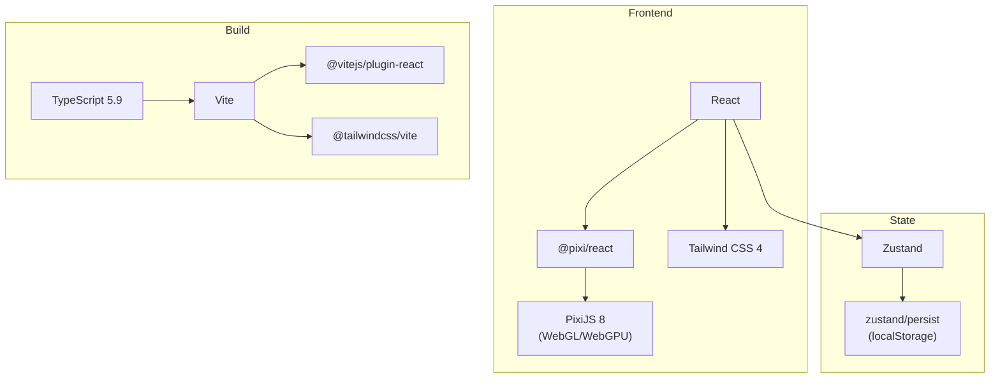

---

## 🚀 วิธีรัน

### Prerequisites

- **Node.js** ≥ 18
- **npm** (มาพร้อม Node.js)

### ขั้นตอน

```bash
# 1. Clone repository
git clone <repo-url>
cd shire-map-builder

# 2. ติดตั้ง dependencies
npm install

# 3. รัน development server
npm run dev

# 4. เปิดเบราว์เซอร์ไปที่ http://localhost:5173
```

### คำสั่งอื่นๆ

```bash
npm run build    # Build สำหรับ production (output: dist/)
npm run preview  # Preview production build
npm run lint     # ตรวจสอบ code quality ด้วย ESLint
```

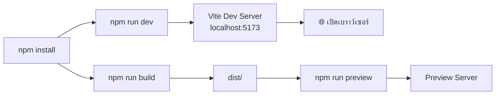

### การใช้งานเบื้องต้น

| การกระทำ               | วิธี                                      |
| ---------------------- | ----------------------------------------- |
| **วาด tile**           | เลือก asset จากแถบล่าง → คลิกซ้ายบนแผนที่ |
| **ลาก paint**          | เลือก asset → คลิกค้างแล้วลาก             |
| **ลบ tile**            | กด 🧹 Erase → คลิกบน tile                 |
| **Pan (เลื่อนแผนที่)** | คลิกกลาง / คลิกขวาลาง / Space + คลิกซ้าย  |
| **Zoom**               | เลื่อน scroll wheel                       |
| **Undo / Redo**        | `Ctrl+Z` / `Ctrl+Shift+Z`                 |
| **Reset camera**       | กดปุ่ม ⌂ หรือ `Home`                      |
| **Export JSON**        | กดปุ่ม 💾 Export                          |
| **Import JSON**        | กดปุ่ม 📂 Import                          |
| **Download PNG**       | กดปุ่ม 📷 PNG                             |

---

## 📁 โครงสร้างโปรเจกต์

```
shire-map-builder/
├── public/tiles/shire/      # Tile sprite images (72 ไฟล์ PNG)
├── src/
│   ├── main.tsx             # Entry point
│   ├── App.tsx              # Root component + keyboard shortcuts
│   ├── components/
│   │   ├── Toolbar.tsx      # แถบเครื่องมือด้านบน
│   │   ├── IsometricCanvas.tsx  # PixiJS Application wrapper
│   │   ├── MapScene.tsx     # Rendering + interaction logic
│   │   └── AssetPicker.tsx  # แถบเลือก tile ด้านล่าง
│   ├── store/
│   │   └── mapStore.ts      # Zustand store (state + actions)
│   ├── data/
│   │   └── shireAssets.ts   # Asset catalog (72 tiles, 6 categories)
│   ├── types/
│   │   └── index.ts         # TypeScript type definitions
│   └── utils/
│       └── isometric.ts     # Isometric math utilities
├── index.html
├── vite.config.ts
├── tsconfig.json
└── package.json
```

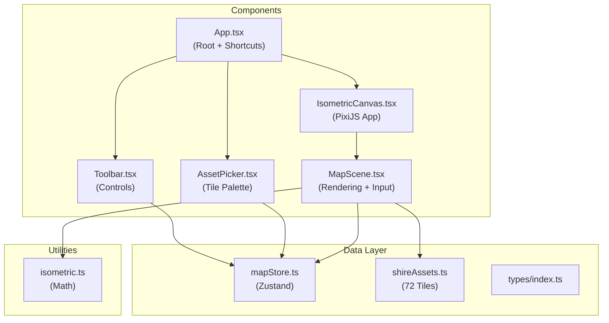

---

## 🧩 Data Model

### Grid & Cell Structure

แต่ละช่องบนแผนที่ (`CellData`) ประกอบด้วย 2 layer:

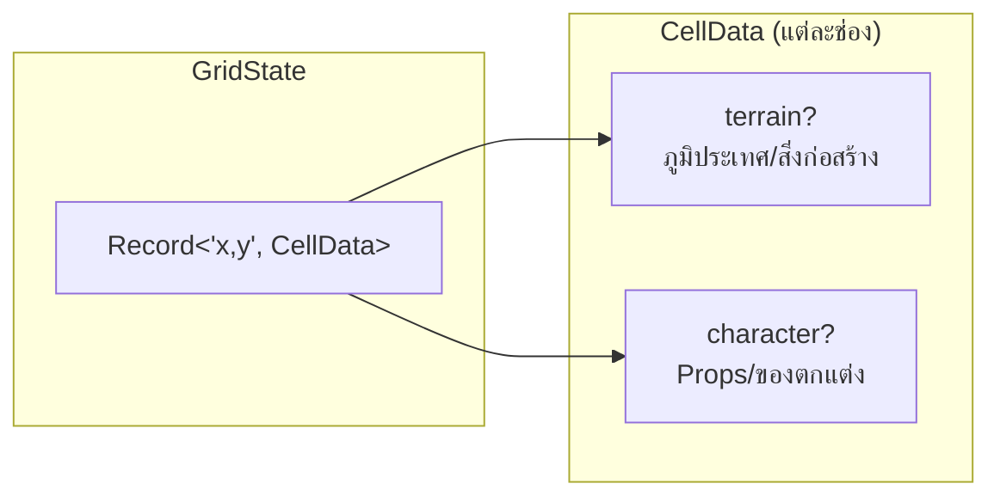

### Asset Categories (6 หมวด, 72 tiles)

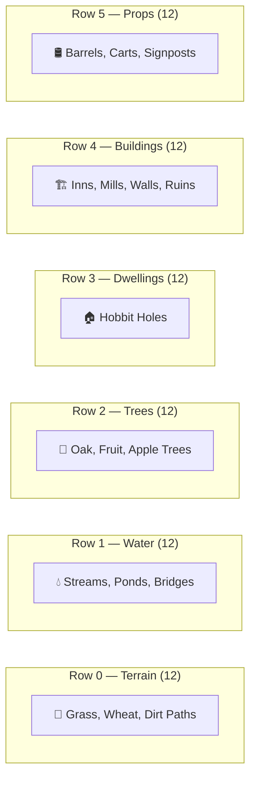

### State Management Flow

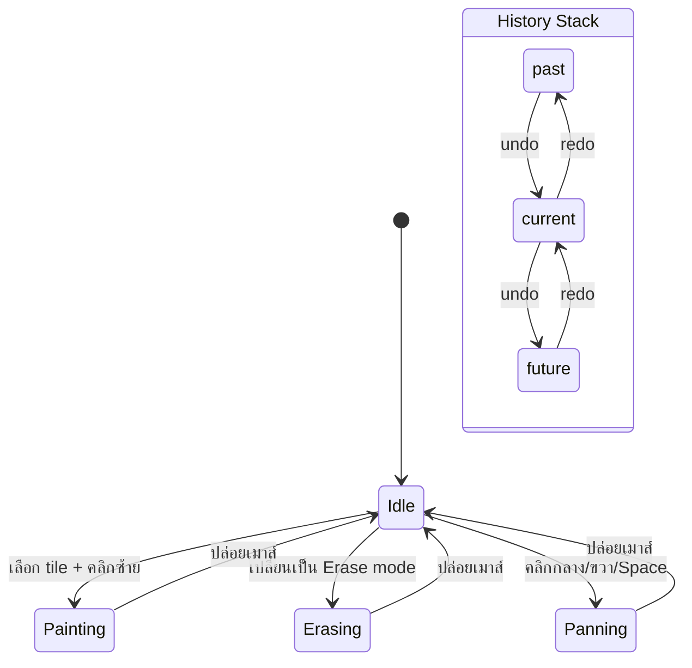

---

## 🔧 วิธีเอาไปต่อยอด

### 1. เพิ่ม Theme ใหม่

สร้างไฟล์ asset catalog ใหม่ตามแบบ `shireAssets.ts`:

```typescript
// src/data/myThemeAssets.ts
import type { TileAsset } from "../types";

function tile(row: number, col: number, category, name: string): TileAsset {
  return {
    id: `mytheme-r${row}-c${col}`,
    category,
    row,
    col,
    name,
    path: `/tiles/mytheme/r${row}-c${col}.png`,
  };
}

export const MY_THEME_ASSETS: TileAsset[] = [
  tile(0, 0, "terrain", "Sand"),
  // ... เพิ่ม tiles อื่นๆ
];
```

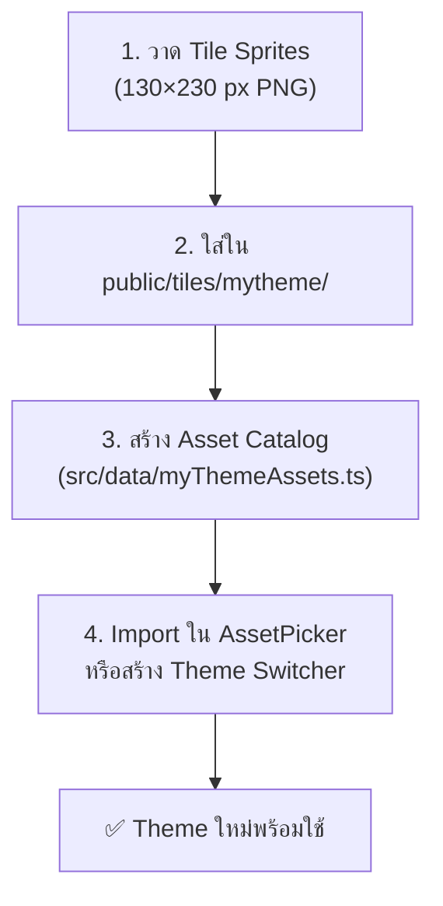

### 2. เพิ่ม Category ใหม่

1. เพิ่มค่าใน `AssetCategory` type ใน `types/index.ts`
2. เพิ่ม tiles ใน asset catalog
3. เพิ่มแท็บใน `AssetPicker.tsx`

### 3. เพิ่มฟีเจอร์ใหม่

| ไอเดีย                   | แนวทาง                                                              |
| ------------------------ | ------------------------------------------------------------------- |
| **Multi-tile selection** | เพิ่ม `selectedTiles: TileAsset[]` ใน store, วาดหลาย tiles พร้อมกัน |
| **Layer system**         | เพิ่ม layers ใน `CellData` (เช่น ground, object, roof)              |
| **Multiplayer**          | เปลี่ยน persistence จาก localStorage เป็น WebSocket + database      |
| **Larger maps**          | ใช้ tile culling (render เฉพาะ tiles ที่อยู่ใน viewport)            |
| **Animation**            | ใช้ PixiJS AnimatedSprite สำหรับ water/character animation          |
| **Custom tile upload**   | เพิ่ม UI สำหรับ upload PNG แล้วเพิ่มเข้า asset catalog              |

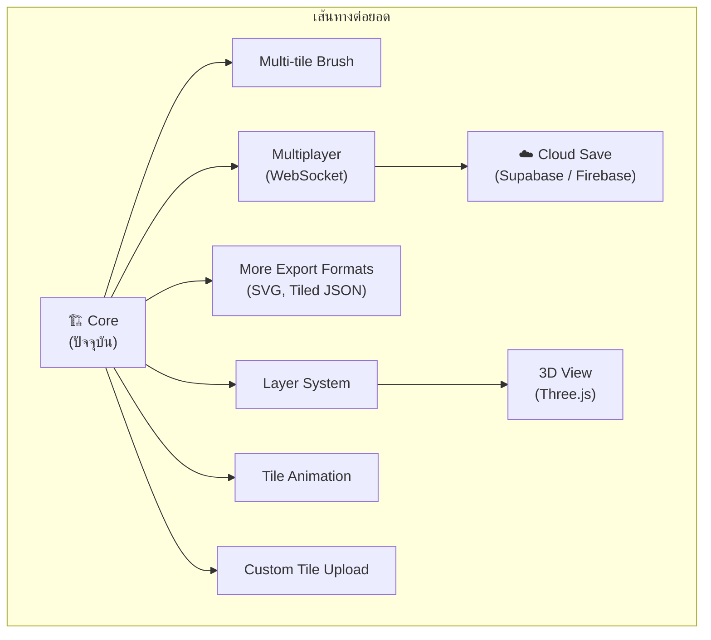

### 4. Key Concepts สำหรับ Developer

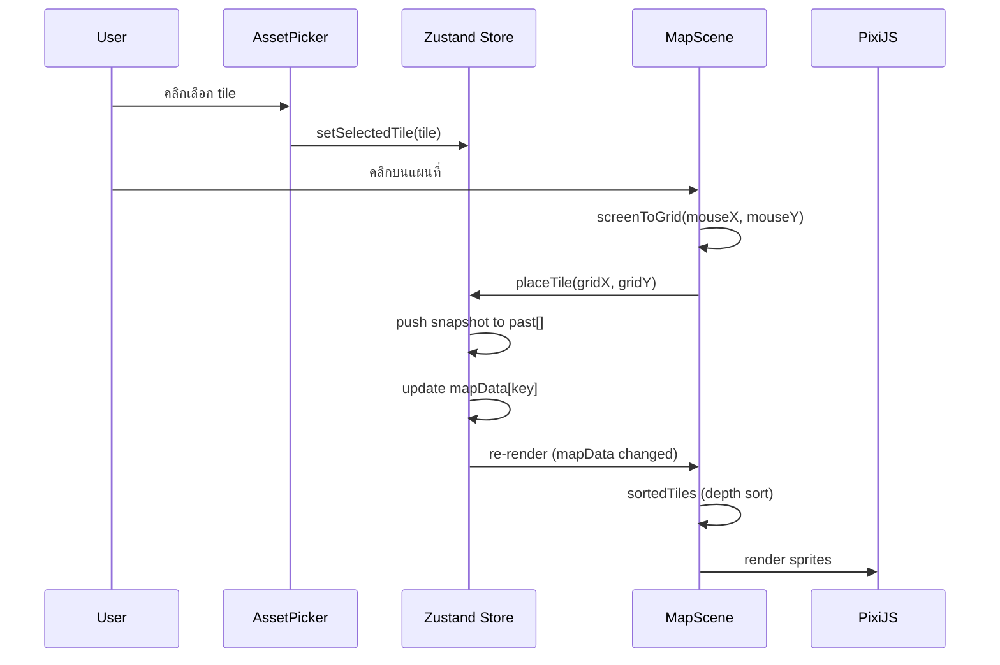

### Tile Sprite Specification

- **ขนาดไฟล์ PNG:** 130 × 230 px
- **Diamond footprint:** 130 × 65 px (อัตราส่วน 2:1)
- **Anchor point:** จุดกึ่งกลาง diamond อยู่ที่ y=160 ของ sprite
- **ตั้งชื่อ:** `r{row}-c{col}.png` (เช่น `r0-c0.png`, `r3-c5.png`)

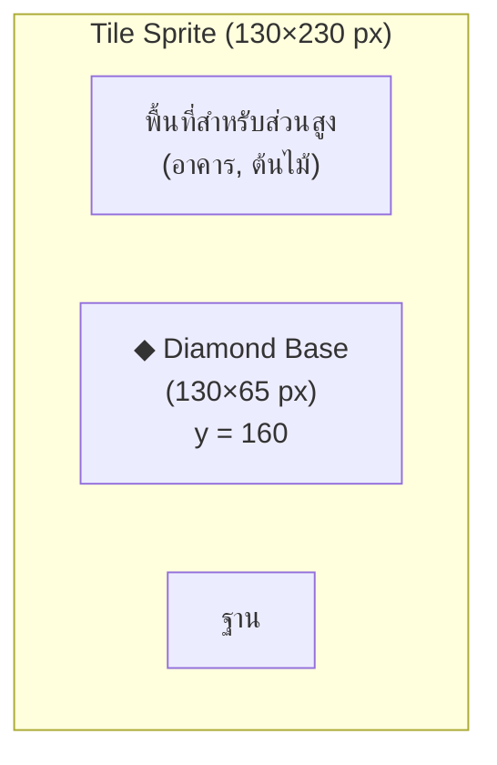

---

## 📄 License

MIT
